<!-- Commit banner.svg to this repo alongside README.md -->

  

  
  
  

<table align="center">
  <tr>
    <td align="center"><b>⏳ 4+ years</b> ML in production</td>
    <td align="center"><b>📦 5 repos</b> tested, benchmarked, documented</td>
    <td align="center"><b>🏆 3 certifications</b> LangChain · Python DS · Power BI</td>
    <td align="center"><b>🎓 MS in IT</b> University of Cincinnati, 2025</td>
  </tr>
</table>

## 🧭 The arc

Started at Amazon as a Data Scientist doing classic ML at scale: forecasting, ETL over millions of daily records, XGBoost in production through SageMaker. The pivot point came with the shift to generative AI: the interesting failures moved from "the model is inaccurate" to "the model is confidently wrong", and that pulled me into LLM systems, retrieval, and evaluation. Now I build RAG architectures, multi-agent workflows, and the monitoring and evaluation infrastructure that keeps them honest in production.

## 🔭 Current focus

- Enterprise LLM systems for document intelligence and semantic search
- RAG architectures balancing retrieval depth, latency, and hallucination rates
- Multi-agent orchestration with task decomposition and self-correction loops
- Evaluation frameworks for grounding accuracy and LLM observability

## 🧱 Building blocks

  

| Domain | Stack | Depth |
|---|---|---|
| LLMs and RAG | LangGraph, LangChain, FAISS, Pinecone, ChromaDB, Hugging Face | ██████████ daily driver |
| ML and DL | PyTorch, TensorFlow, scikit-learn, XGBoost, LightGBM | ██████████ daily driver |
| MLOps | MLflow, drift detection, CI/CD for ML, model versioning | ████████░░ production experience |
| Serving | FastAPI, Docker, AWS SageMaker, GCP AI Platform | ████████░░ production experience |
| Data | ETL pipelines, SQL, pandas, large-scale preprocessing | ████████░░ production experience |
| Analytics | Power BI, Tableau, Plotly, Seaborn | ██████░░░░ working proficiency |

## 📌 The proof: five deep-dive repos

Every number in these READMEs was measured, every behavior claimed is tested, and every design decision has an ADR.

| Repo | What it shows | The one detail worth clicking for |
|---|---|---|
| [drift-sentinel](https://github.com/YOUR-GITHUB-USERNAME/drift-sentinel) | Statistical drift detection as a FastAPI service | The test suite caught a real KS-test false positive; the fix is a commit you can read |
| [rag-evalkit](https://github.com/YOUR-GITHUB-USERNAME/rag-evalkit) | Offline-first RAG evaluation with CI quality gates | Zero-dependency core; its own CI gates on `mrr=0.9` using the tool itself |
| [agentic-extract](https://github.com/YOUR-GITHUB-USERNAME/agentic-extract) | Self-correcting multi-agent extraction on LangGraph | Validator errors literally become the next attempt's prompt feedback, provably, in tests |
| [attention-lab](https://github.com/YOUR-GITHUB-USERNAME/attention-lab) | Transformer from scratch in PyTorch | Causality proven by gradient, parity with `nn.MultiheadAttention` to 1e-5 |
| [tabular-ml-pipeline](https://github.com/YOUR-GITHUB-USERNAME/tabular-ml-pipeline) | Gated ETL, tuned XGBoost, MLflow tracking | Training physically cannot accept data that failed the quality gate |

## 🎲 Outside the code

<!-- Fill this with your real interests, one emoji row, e.g.: ♟️ chess · 🏏 cricket · 🎧 lo-fi while debugging -->
<!-- Delete the section if you'd rather keep it strictly professional -->

## 🤝 Quick connect

  
  &nbsp;
  

  The fastest way to evaluate me is to open any repo above and read one ADR.

